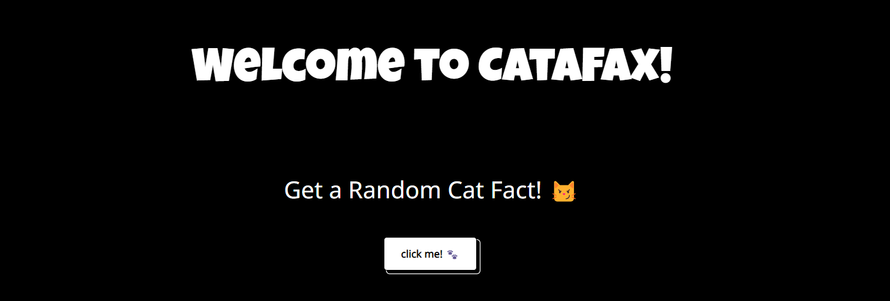
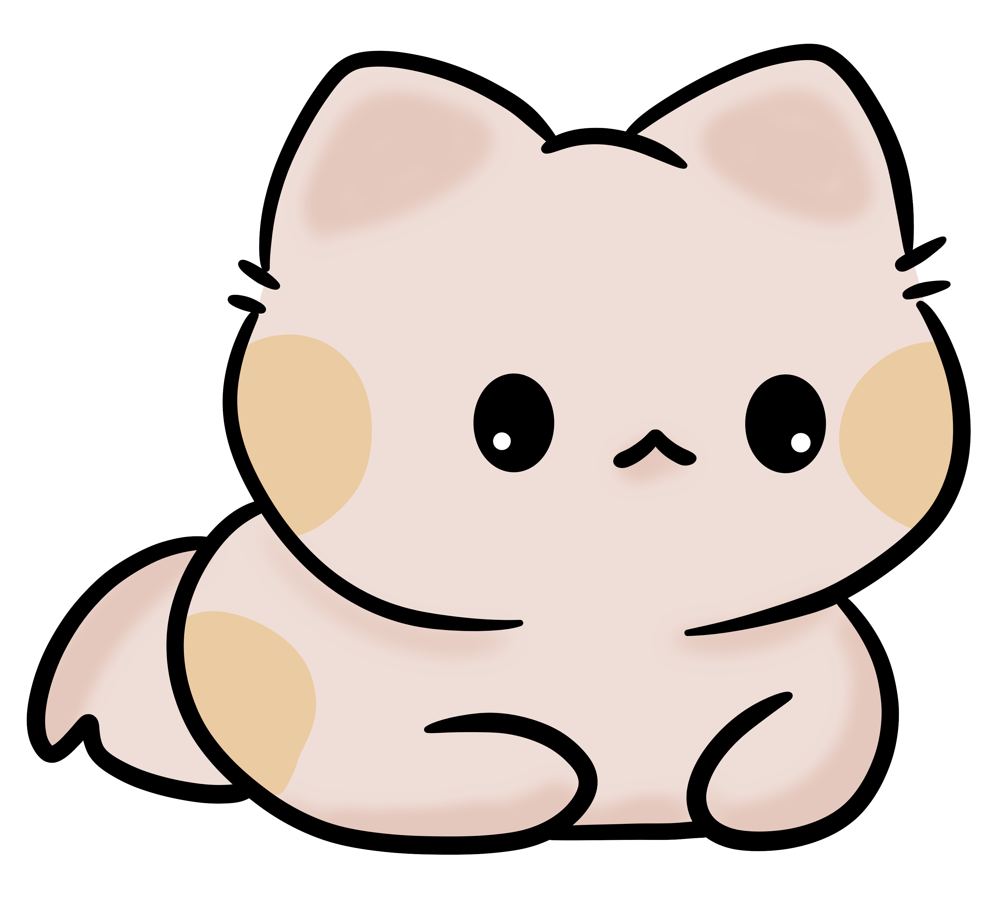

# CataFax 🐈

<em> (Tap on this cute cat to view the project)</em>

 

# Overview
Welcome to <strong>CataFax<strong>! This project seamlessly integrates HTML, CSS, and JavaScript to deliver an entertaining and dynamic experience to discover random cat facts with each button press. In creating this project, I learned how to use APIs, adding cool features to make it more interesting.

 

# Technologies Used

  

 

# Features
This project has the following features:

<ul>
    <li><strong>Random Cat Facts:</strong> Retrieve intriguing cat facts using asynchronous JavaScript functions, promises, and the integration of external APIs.</li>
    <li><strong>Dynamic Content Loading:</strong> Implementing async functions and the 'await' keyword to efficiently fetch and display cat facts, creating a smooth user experience.</li>
    <li><strong>Meow Sound Button:</strong> Added a button that produces a delightful 'meow' sound on every click, enhancing the interactive and playful nature of the project.</li>
    <li><strong>Welcoming Heading:</strong> Included a welcoming heading to greet users and create a friendly atmosphere for cat facts exploration.</li>
    <li><strong>Ending Cat GIF:</strong> Concluded the experience with an adorable cat GIF, adding a touch of humor and linking to the project's GitHub repository for further exploration.</li>
</ul>
    
 

# Learnings:

Here are the key learnings from the CataFax project:

<ul>
    <li><strong>API Integration:</strong> Acquired valuable insights into working with APIs, harnessing external data to dynamically fetch random cat facts.</li>
    <li><strong>Asynchronous Programming:</strong> Developed an understanding of promises, async functions, and the 'await' keyword to efficiently handle asynchronous operations when fetching and displaying cat facts.</li>
    <li><strong>JSON File Handling:</strong> Explored the use of JSON files for storing and managing cat facts, gaining proficiency in handling structured data within a web project.</li>
    <li><strong>Responsive Design:</strong> Mastered the art of responsiveness, ensuring the project functions seamlessly on various devices, providing an optimal user experience.</li>
    <li><strong>HTML and CSS Mastery:</strong> Applied HTML and CSS skills to create an interactive and visually appealing user interface, enhancing the overall project aesthetics.</li>
    <li><strong>JavaScript Proficiency:</strong> Strengthened JavaScript skills by implementing dynamic content loading, real-time updates, and user interaction features for an engaging cat facts experience.</li>
</ul>

 

# Conclusion

Thanks for checking out CataFax, where cat facts meet fun! This project was all about exploring cool things with JavaScript, APIs, and making content dynamic. I hope you enjoy the cat facts and maybe learn a little something. 

 

Feel free to dive into the code, contribute, or use it for educational purposes. Your feedback and contributions are immensely valuable.

  

  More exciting stuff coming soon! 🐱✨

